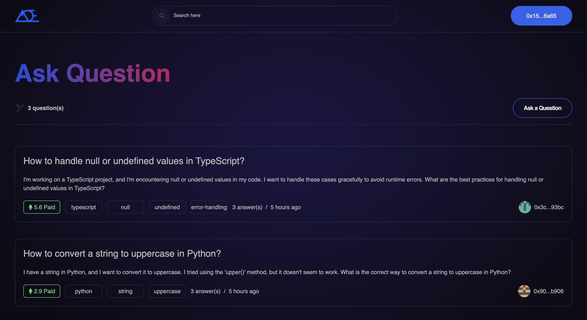
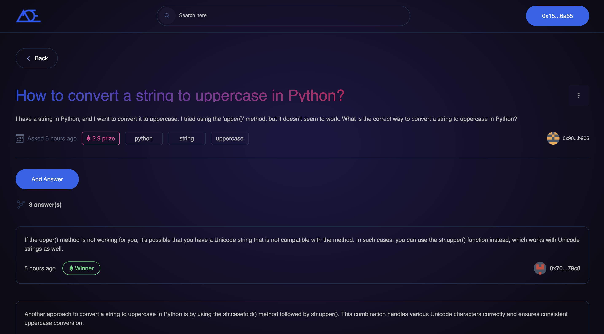
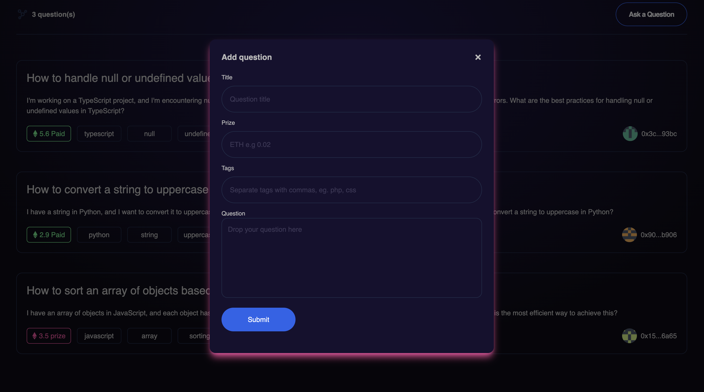

# How to Build an Answer to Earn (A2E) Platform with NextJs, TypeScript, Tailwind CSS, and Solidity

Read the full tutorial here: [**>> How to Build an Answer to Earn (A2E) Platform with NextJs, TypeScript, Tailwind CSS, and Solidity**](https://daltonic.github.io)

This example shows How to Build an Answer to Earn (A2E) Platform with NextJs, TypeScript, Tailwind CSS, and Solidity:


<center><figcaption>Questions</figcaption></center>


<center><figcaption>Creating Questions</figcaption></center>


<center><figcaption>Questions Details</figcaption></center>

## Technology

This demo uses:

- Metamask
- Hardhat
- Infuira
- NextJs
- TypeScript
- Tailwind CSS
- Solidity
- EthersJs
- Faucet

## Running the demo

To run the demo follow these steps:

1. Clone the project with the code below.

   ```sh

   # Make sure you have the above prerequisites installed already!
   git clone https://github.com/Daltonic/answer_to_earn answerToEarn
   cd answerToEarn # Navigate to the new folder.
   ```

2. Create a `.env` file to include the following details.
   ```sh
    NEXT_APP_RPC_URL=http://127.0.0.1:8545/
   ```
3. On one terminal, run the app using:
   ```
    yarn install
    yarn hardhat run scripts/deploy.js
   ```

4. On a second terminal, run the app using `yarn dev` to launch on the browser.
   <br/>

If your confuse about the installation, check out this **TUTORIAL** to see how you should run it.

Questions about running the demo? [Open an issue](https://github.com/Daltonic/answer_to_earn/issues). We're here to help ✌️

## Useful links

- 🏠 [Website](https://daltonic.github.io/)
- ⚽ [Metamask](https://metamask.io/)
- 🚀 [Infuria](https://app.infura.io/dashboard/)
- 💡 [Hardhat](https://hardhat.org/)
- 🔥 [NextJs](https://nextjs.org/)
- 🐻 [Solidity](https://soliditylang.org/)
- 👀 [Ethersjs](https://docs.ethers.io/v5/)
- ✨ [Live Demo](https://answer-to-earn.vercel.app/)
